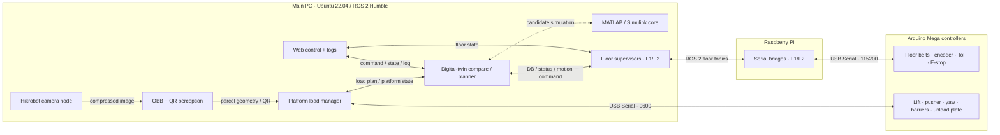

# MileMate Digital Twin Logistics

MileMate는 배송 차량 내부를 다층 순환형 시퀀스 버퍼로 구성해 택배 인식,
적재, 위치 추적, 목표 물품 준비와 하차를 자동화한 졸업 프로젝트입니다.
Ubuntu 22.04, ROS 2 Humble, Python 3.10, Arduino Mega와 MATLAB/Simulink를
기준으로 개발했습니다.

## 현재 상태

이 저장소는 세 개의 원본 작업 폴더를 보존한 채 코드·펌웨어·모델 메타데이터와
문서를 한 구조로 통합한 리팩터링본입니다. Python 구문·정적 분석, 순수 로직
단위 테스트, ROS↔Arduino 문자열 프로토콜, 모델 체크섬과 Simulink 파일 무결성은
검사했습니다.

다만 현재 Windows 점검 환경에는 ROS 2 Humble, Arduino CLI, 사용 가능한
MATLAB/Simulink와 실제 장비가 없어 전체 빌드 및 실기 E2E는 아직 실행하지
못했습니다. 따라서 현 단계는 **정적 검증 완료, 실장비 회귀 검증 대기**입니다.
보관된 2026-06-24 MATLAB 실행은 적재 1건은 통과했지만 첫 목표 하차 P55가
36,000 step에서 `CIRCULATION WAIT`로 종료되어 이후 시나리오가 중단됐습니다.
이 결과는 현재 선택한 제어 코어보다 이전 기록이므로 현재 코드의 실패/통과
판정으로 재사용하지 않고 재현용 이력으로만 보존합니다.

## 시스템 아키텍처

실제 2층 프로토타입은 Main PC, Raspberry Pi, Arduino Mega로 제어 책임을
분리했습니다. 상위 계층은 택배 DB와 이동 계획을, 하위 계층은 센서 피드백과
액추에이터 구동을 담당합니다.



- **Main PC:** 인식, 적재·하차 상태머신, 택배 DB, 순환 계획, 웹 UI와 디지털 트윈
- **Raspberry Pi:** 층별 Arduino USB Serial과 ROS 2 토픽 사이의 브리지
- **층별 Arduino Mega:** B1~B4 모터, 엔코더, ToF와 E-stop 처리
- **플랫폼 Arduino Mega:** 리프트, 푸셔, yaw 회전판, 배리어, 하차 플레이트

컴포넌트 책임, 적재·하차 시퀀스, 주요 ROS 2 토픽과 Serial 규약은
[`docs/architecture/system-overview.md`](docs/architecture/system-overview.md)에
정리했습니다.

## 저장소 구조

```text
ros2_ws/src/   ROS 2 패키지 4개
firmware/      운용 펌웨어, 축별 bench test, legacy 이력
matlab/        디지털 트윈 소스와 과거 회귀 기준값
perception/    데이터 준비·학습·진단 도구와 모델 카드
data/          데이터 정책과 매니페스트; 이미지·라벨은 Git 제외
artifacts/     로컬 모델과 실행 산출물; Git 제외
tests/         ROS 없이 실행 가능한 순수 로직·시리얼 수명주기 테스트
docs/          아키텍처, 하드웨어, 이관 기록, 검증 문서
scripts/       환경 설정과 자동 검사
```

취업·포트폴리오용으로 선별한 학습 수치, 실제 등록 샘플, 순환 회귀 로그와 그래프는
[`docs/evidence/README.md`](docs/evidence/README.md)에 정리했습니다. 과거 실행의
성공과 한계를 함께 기록하며, 프로젝트 결과와 개인 기여 범위를 구분합니다.

## 새 환경 준비

```bash
git clone <repository-url> milemate-digital-twin-logistics
cd milemate-digital-twin-logistics

source /opt/ros/humble/setup.bash
python3 -m venv --system-site-packages .venv
source .venv/bin/activate
python3 -m pip install --upgrade pip
python3 -m pip install -r requirements.txt

rosdep install --from-paths ros2_ws/src --ignore-src -r -y
colcon --log-base ros2_ws/log build \
  --base-paths ros2_ws/src \
  --build-base ros2_ws/build \
  --install-base ros2_ws/install \
  --symlink-install

source ros2_ws/install/setup.bash
source scripts/milemate_env.sh
```

Hikrobot 카메라는 별도 MVS SDK가 필요합니다. MATLAB 디지털 트윈을 사용할
경우 MATLAB/Simulink도 별도로 설치해야 합니다. 두 상용 구성요소는 저장소에
포함하지 않습니다.

## 모델과 데이터셋

추론 실행에는 학습 데이터셋이 필요하지 않지만 OBB 모델 파일은 필요합니다.
팀 내부 보관본 또는 향후 Release 자산에서 다음 위치로 복사합니다.

```text
artifacts/models/box_obb_s_512/best.pt
```

다른 위치라면 `MILEMATE_MODEL_PATH`를 지정할 수 있습니다. 복사 후 파일을
검증합니다.

```bash
python3 scripts/validate_runtime_assets.py
```

MATLAB이 설치된 환경에서는 quick 회귀 2종을 각각 독립 프로세스로 실행합니다.

```bash
python3 scripts/run_matlab_validation.py --profile quick --suite all
```

quick 결과가 모두 통과한 뒤 `--profile standard`로 전체 시나리오를 실행합니다.

검증 대상 모델의 크기와 SHA-256은
`perception/models/box_obb_s_512/model-card.md`에 기록되어 있습니다. 데이터셋은
재학습·평가·라벨 수정 때만 필요하며 Git에 직접 커밋하지 않습니다.

## 실행 모드

모델·카메라 없이 플랫폼 제어 노드와 launch 인자만 확인하는 모드입니다.

```bash
ros2 launch platform_loading_control platform_loading.launch.py \
  dry_run:=true start_camera:=false start_perception:=false show_debug_view:=false
```

카메라와 플랫폼 Arduino를 연결한 통합 실행 예시는 다음과 같습니다.

```bash
ros2 launch platform_loading_control platform_loading.launch.py \
  start_camera:=true start_perception:=true \
  platform_port:=/dev/serial/by-id/YOUR_PLATFORM_ARDUINO \
  target_floor:=1
```

전체 Main PC/Pi/층별 실행 순서와 확인 항목은
`docs/operations/runtime-checklist.md`를 따릅니다.

## 검증

ROS나 MATLAB이 없는 환경에서도 실행 가능한 검사는 다음과 같습니다.

```bash
PYTHONDONTWRITEBYTECODE=1 python3 -m unittest discover -s tests -v
python3 scripts/validate_workspace.py
python3 scripts/validate_protocols.py
python3 scripts/validate_matlab_static.py
python3 scripts/validate_runtime_assets.py
python3 scripts/validate_evidence.py
```

Ubuntu 22.04 장비에서는 의존성 설치와 `colcon build`까지 묶은 다음 스크립트를
사용합니다.

```bash
bash scripts/validate_ubuntu.sh
```

정적 검사는 핀 방향, 기구 간섭, 실제 거리 보정, 카메라 프레임, MATLAB 계산
결과를 보장하지 않습니다. 마지막 검사 결과와 미실행 범위는
`docs/validation/last-run-2026-08-24.md`에 기록했습니다.

## 안전

- 플랫폼에는 물리 원점·리미트 센서가 없으므로 `H`와 `Z0`는 실제 홈 동작이
  아니라 현재 좌표를 0으로 받아들이는 명령입니다.
- 플랫폼의 ROS `stop/cancel`은 다음 시퀀스를 중단하지만 이미 Arduino가 수행
  중인 blocking 푸셔 동작을 즉시 abort하지 못합니다. 하드웨어 E-stop 없이
  무인·고출력 운전하지 않습니다.
- 벨트 펌웨어의 fault와 E-stop은 명시적 해제 전까지 motion 명령을 거부합니다.
- 웹 제어 UI에는 인증이 없으므로 외부망에 노출하지 말고 신뢰된 실험망에서만
  사용합니다.
- 모터 전원을 분리한 통신 확인 후 저속·짧은 거리·축별 시험을 먼저 수행합니다.

## 공개 및 라이선스

현재 오픈소스 라이선스는 부여하지 않았습니다. 팀원 동의, 데이터와 모델 공개
권한, Hikrobot SDK 및 제3자 코드 재배포 조건을 검토하기 전에는 공개 저장소나
오픈소스 프로젝트로 배포하지 마세요. 세부 상태는 `LICENSE_STATUS.md`에 있습니다.
