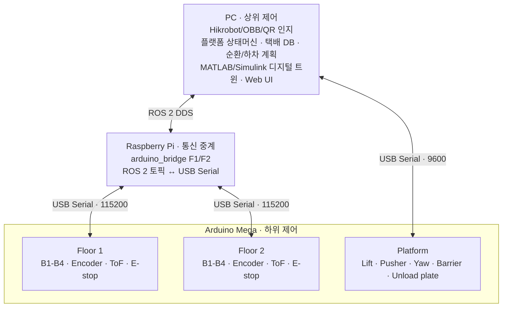
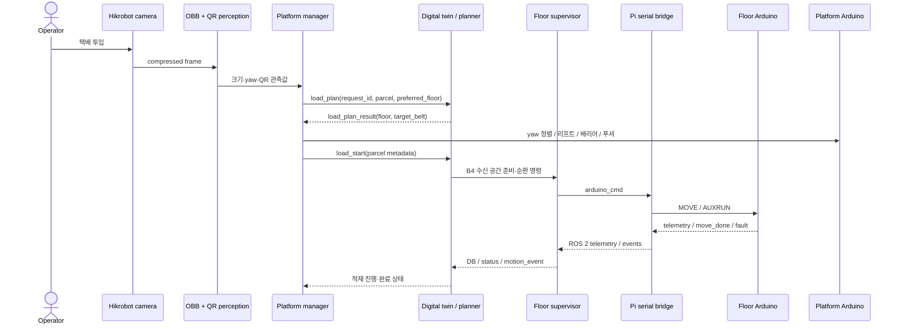
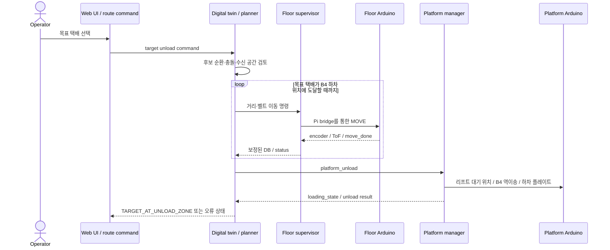

# 시스템 아키텍처

MileMate는 배송 차량 내부의 다층 폐루프 컨베이어를 **순환형 시퀀스 버퍼**로
사용합니다. 실제 프로토타입은 2층이며, 저장소의 기본 다층 launch도 F1/F2를
구동합니다. 플랫폼 코드에 남아 있는 F3 높이 파라미터는 확장용 인터페이스이지
최종 시연에서 검증한 실물 3층을 의미하지 않습니다.

## 1. 설계 원칙

- **계층 분리:** 계획·DB, 장치 중계, 실시간 구동을 Main PC–Pi–MCU로 분리합니다.
- **단일 소유권:** 각 Serial 포트는 하나의 ROS 2 노드만 열어 명령 충돌을 막습니다.
- **피드백 기반 갱신:** 엔코더와 ToF 결과를 다음 계획과 DB 보정에 반영합니다.
- **사전 검토:** 후보 이동은 디지털 트윈 계층에서 검토한 뒤 실제 장치 명령으로
  변환합니다.
- **실물 우선 검증:** 시뮬레이션 상태를 곧바로 실제 성공으로 간주하지 않고
  하위 이벤트와 센서 피드백을 별도로 확인합니다.

## 2. 배치 구조



### 실행 위치와 책임

| 실행 위치 | 구성요소 | 책임 | 코드 위치 |
| --- | --- | --- | --- |
| Main PC | `hik_camera` | Hikrobot MVS 프레임을 ROS 2 이미지로 발행 | `ros2_ws/src/hik_camera` |
| Main PC | `parcel_perception` | OBB, 택배 크기·yaw, 선택적 QR 추정 | `ros2_ws/src/platform_loading_control` |
| Main PC | `platform_load_manager` | 플랫폼 Serial 단독 소유, 적재·하차 상태머신 실행 | `ros2_ws/src/platform_loading_control` |
| Main PC | `digital_twin_compare` | 후보 적재·순환·하차 계획, 실제 상태와 비교, 명령 생성 | `ros2_ws/src/refuge_circulation_control` |
| Main PC | MATLAB/Simulink | 시뮬레이션 코어와 후보 이동 검토 | `matlab/digital_twin` |
| Main PC | `supervisor` F1/F2 | 층별 택배 DB, 이동 시퀀스, 센서 결과 해석 | `ros2_ws/src/refuge_circulation_control` |
| Main PC | `web_control` | 상태·로그 집계와 실험용 명령 UI | `ros2_ws/src/refuge_circulation_control` |
| Raspberry Pi | `arduino_bridge` F1/F2 | ROS 2 문자열과 층별 USB Serial 프레임 변환 | `ros2_ws/src/refuge_circulation_control` |
| Floor MCU | `refuge_belt_controller` | B1~B4 구동, 엔코더 PI, ToF, E-stop, fault latch | `firmware/refuge_belt_controller` |
| Platform MCU | `platform_controller` | 리프트·푸셔·yaw·배리어·하차 플레이트 구동 | `firmware/platform_controller` |

## 3. 책임과 상태의 소유권

| 상태 또는 자원 | 소유 계층 | 비고 |
| --- | --- | --- |
| 택배 식별·크기·yaw 관측값 | Perception | 관측 결과만 발행하며 층·벨트를 최종 결정하지 않음 |
| 적재·하차 플랫폼 시퀀스 | `platform_load_manager` | 플랫폼 Serial 포트를 단독 소유 |
| 층별 택배 DB와 컨베이어 위치 | `supervisor` / digital twin | MCU 내부 DB를 정본으로 사용하지 않음 |
| 적재 슬롯·순환·목표 하차 계획 | digital twin / MATLAB | 실제 센서 결과로 계획 상태를 보정 |
| 층별 이동 실행과 센서 텔레메트리 | Floor Arduino | 상위 DB나 배송 순서를 판단하지 않음 |
| 리프트·푸셔·서보의 저수준 동작 | Platform Arduino | 소프트웨어 좌표 기준; 절대 홈 센서 없음 |
| 층별 USB Serial 포트 | 해당 `arduino_bridge` | Serial monitor와 동시 사용 금지 |
| 플랫폼 USB Serial 포트 | `platform_load_manager` | 다른 플랫폼 제어 노드와 동시 사용 금지 |

## 4. 주요 ROS 2 인터페이스

`N`은 실제 기본 구성의 층 번호 `1` 또는 `2`입니다. 대부분의 제어·상태
메시지는 `std_msgs/String`의 JSON 또는 명령 문자열이며, bridge가 센서 배열을
별도 토픽으로도 제공합니다.

| 토픽 | 방향 | 내용 |
| --- | --- | --- |
| `/hik_camera/rgb/compressed` | camera → perception | JPEG 압축 카메라 프레임 |
| `/platform/parcel_detection` | perception → platform manager | OBB, 크기, yaw, QR과 confidence |
| `/platform/loading_cmd` | twin/UI → platform manager | 적재 시작, 플랫폼 하차, 정지·취소 요청 |
| `/platform/loading_state` | platform manager → twin/UI | 플랫폼 상태머신, 진행 상태, 오류 |
| `/platform/loading_events` | platform manager → logger/UI | 단계별 이벤트와 진단 기록 |
| `/platform/load_plan_result` | twin → platform manager | 요청 ID에 대응하는 목표 층·벨트 계획 |
| `/refuge/floorN/twin_cmd` | platform/UI → twin | 적재 계획, 순환, 목표 하차 명령 |
| `/refuge/floorN/twin_state` | twin → platform/UI | 자동 시퀀스 단계와 계획 상태 |
| `/refuge/floorN/control_cmd` | twin/UI → supervisor | MOVE, 상태 변경과 운용 명령 |
| `/refuge/floorN/db` | supervisor → twin/platform/UI | 층별 택배 위치·크기·상태 DB |
| `/refuge/floorN/status` | supervisor → twin/platform/UI | 하드웨어·시퀀스 상태 |
| `/refuge/floorN/arduino_cmd` | supervisor → bridge | 층별 MCU로 보낼 Serial 명령 |
| `/refuge/floorN/telemetry` | bridge → supervisor/UI | MCU JSON 텔레메트리 원문 |
| `/refuge/floorN/events` | bridge → supervisor/UI | `ready`, `move_start`, `move_done`, `fault` |
| `/refuge/floorN/tof` | bridge → diagnostics | ToF 거리 배열 |
| `/refuge/floorN/encoders` | bridge → diagnostics | 엔코더 count 배열 |
| `/refuge/floorN/motor_state` | bridge → diagnostics | 모터 상태 요약 |
| `/refuge/floorN/bridge_state` | bridge → UI | 포트 연결·재연결 상태 |

## 5. 적재 시퀀스



핵심은 인식 결과가 곧바로 모터 명령이 되지 않는다는 점입니다. 플랫폼 관리자가
계획 요청 ID로 목표 층·벨트를 확인하고, 플랫폼 인계와 층별 순환을 각각의
하위제어기로 분리해 실행합니다.

## 6. 목표 하차 시퀀스



## 7. Serial 경계

### 층별 컨베이어

- `arduino_bridge` ↔ `refuge_belt_controller`
- 115200 baud, line-delimited command와 JSON telemetry
- 주요 명령: `PING`, `MOVE`, `AUXRUN`, `STOP`, `STOPB`, `ZERO`, `STATUS`,
  `SET`, `CLEAR_FAULT`
- 주요 이벤트: `ready`, `move_start`, `move_done`, `fault`, `telemetry`
- E-stop 또는 fault가 활성화되면 motion 명령을 거부하고 fault를 latch합니다.

### 상하차 플랫폼

- `platform_load_manager` ↔ `platform_controller`
- 9600 baud, line-delimited command/response
- 주요 명령: yaw `S`, 하차 플레이트 `T`, 층별 배리어 `B`, 리프트 `Z`,
  푸셔 `PM`/`PR`
- 현재 위치를 0으로 받아들이는 `Z0`/`H`는 실제 homing 명령이 아닙니다.

정확한 문자열 호환성은 `scripts/validate_protocols.py`에서 검사합니다.

## 8. 실패 격리와 안전 경계

- 층별 MCU의 E-stop·fault는 실제 belt motion을 차단하지만, 플랫폼 MCU에는
  동일한 공통 motion abort가 아직 없습니다.
- 플랫폼 푸셔는 일부 blocking pulse 구조이므로 ROS `stop/cancel`이 이미 시작된
  동작을 즉시 중단하지 못합니다.
- 플랫폼 리프트와 푸셔에는 절대 홈 센서가 없어 전원 인가 후 실제 위치와
  소프트웨어 좌표를 먼저 맞춰야 합니다.
- bridge는 USB Serial 재연결을 담당하지만, 일시적으로 telemetry가 조용하다는
  이유만으로 MCU를 재연결해 리셋하지 않도록 구성했습니다.
- 웹 UI에는 인증이 없으므로 신뢰된 실험망에서만 사용합니다.

실장비 연결 순서와 축별 저속 시험은
[`docs/operations/runtime-checklist.md`](../operations/runtime-checklist.md)를 따릅니다.

## 9. 코드 구조 매핑

```text
ros2_ws/src/hik_camera/                  camera driver
ros2_ws/src/platform_loading_control/    perception + platform state machine
ros2_ws/src/refuge_circulation_control/  supervisors + twin adapter + Pi bridge + UI
firmware/platform_controller/            platform Arduino firmware
firmware/refuge_belt_controller/         floor Arduino firmware
matlab/digital_twin/                     MATLAB/Simulink model and regression suites
perception/                              dataset tooling, training and registration
```

관련 문서:

- [ROS 2 워크스페이스와 패키지 역할](../../ros2_ws/README.md)
- [플랫폼 펌웨어와 핀맵](../hardware/firmware-status.md)
- [실장비 실행 체크리스트](../operations/runtime-checklist.md)
- [검증 범위와 미실행 항목](../validation/README.md)
- [취업·포트폴리오용 정량 증빙](../evidence/README.md)

## 10. 포트폴리오 해석 범위

- Main PC–Raspberry Pi–Arduino 분산제어 통합, 하위제어기, 전장 구성, ToF·엔코더
  보정과 실물 시스템 시험·검증은 이수현의 핵심 기여 범위입니다.
- MATLAB/디지털 트윈 상위제어 핵심 구현은 팀원이 담당했고, 이수현은 실물
  적용 과정에서 반복 시험, 파라미터 조정, 정체·오류 조건 분석과 수정안 제안을
  중심으로 기여했습니다.
- 전체 시스템 조립과 패키징은 팀 공동 작업입니다.

현재 저장소는 정적 검사와 프로토콜 일관성 검사를 통과했지만, MATLAB/Simulink,
Arduino CLI와 실제 장비가 없는 Windows 정리 환경에서는 전체 E2E를 재실행하지
못했습니다. 따라서 이 문서는 **구현된 코드 경계와 과거 운용 구조**를 설명하며,
현재 리팩터링본의 실장비 성능 보증으로 해석하지 않습니다.
