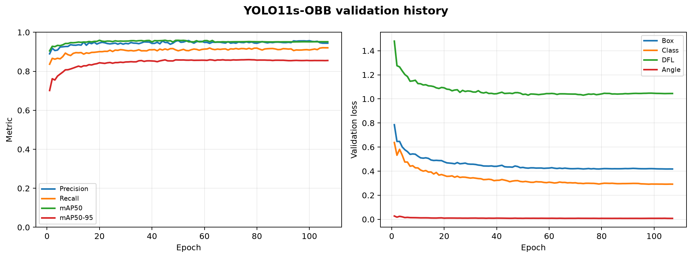
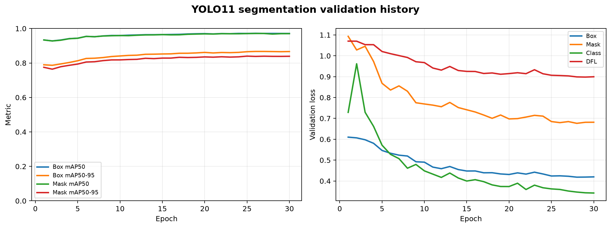
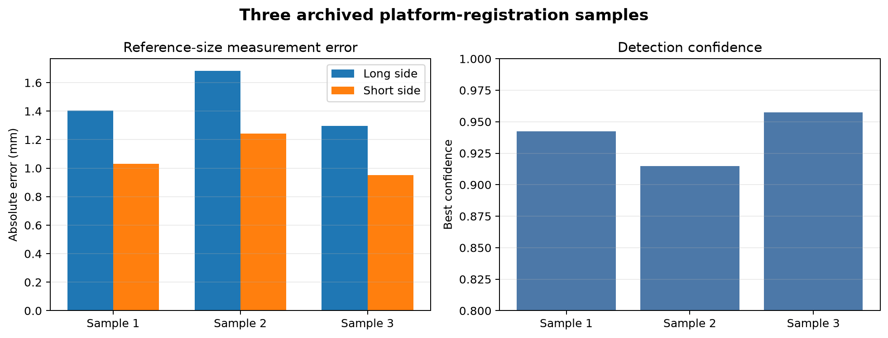
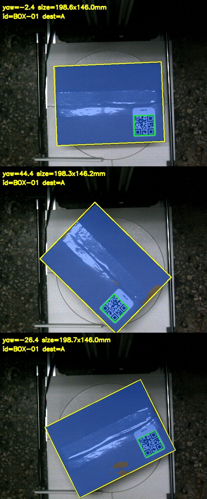
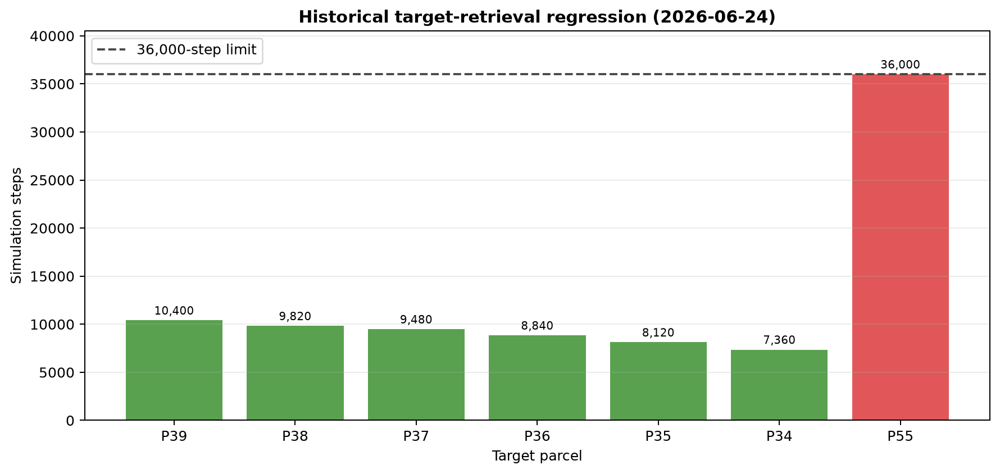

# Portfolio Evidence Index

이 폴더는 원본 작업 폴더에 흩어져 있던 학습 기록, 실제 플랫폼 인식 샘플과
MATLAB 회귀 결과를 취업·포트폴리오 검토에 사용할 수 있는 크기로 선별한
증빙 묶음입니다. 원본 데이터셋, 모델 가중치, 수십 MB 학습 콘솔 로그와 중복
빌드 로그는 포함하지 않았습니다.

> 아래 수치는 2026년 6월에 보존된 실행 결과입니다. 2026년 8월 리팩터링본에서
> 다시 측정한 결과가 아니며, 표본과 평가셋의 공개 적합성도 별도 검토가
> 필요합니다. 프로젝트 수준의 결과와 개인 기여를 구분해서 사용합니다.

## 개인 기여 범위

- Main PC–Raspberry Pi–Arduino 분산 제어 구조 구현과 하위 제어기 통합
- 모터·드라이버·센서·액추에이터 및 전기 용량 검토, 배선과 시스템 구성
- ToF·엔코더 보정, 실제 구동 시험과 시스템 전반의 테스트·검증
- 팀원이 구현한 MATLAB/디지털 트윈 상위 제어를 필드 엔지니어 관점에서
  반복 시험하고 파라미터·정체 조건·수정안을 기록
- 전체 시스템 조립과 패키징은 팀 공동 수행

인식 모델 학습 수치는 시스템 통합 과정에서 사용한 **프로젝트 산출물**입니다.
개인 단독 성과로 표현하지 않습니다.

## 1. OBB 인식 모델

최종 통합 후보 `YOLO11s-OBB`, 입력 512의 보존된 107 epoch 기록입니다. 각
최댓값은 서로 다른 epoch에서 관측됐으므로 하나의 checkpoint 성능으로 합쳐
표현하지 않습니다.

| 지표 | 보존 기록의 최댓값 | Epoch |
| --- | ---: | ---: |
| Precision | 0.95756 | 50 |
| Recall | 0.92065 | 105 |
| mAP50 | 0.95909 | 45 |
| mAP50-95 | 0.85960 | 77 |



- 원시 epoch 로그: [`obb-training-results.csv`](perception/obb-training-results.csv)
- 개인정보·절대경로를 제거한 설정: [`obb-training-config.yaml`](perception/obb-training-config.yaml)

## 2. Segmentation 선행 모델

OBB 전환 전 사용한 30 epoch segmentation 학습 이력입니다.

| 지표 | 보존 기록의 최댓값 | Epoch |
| --- | ---: | ---: |
| Box mAP50 | 0.97221 | 26 |
| Box mAP50-95 | 0.86695 | 27 |
| Mask mAP50 | 0.97113 | 26 |
| Mask mAP50-95 | 0.83979 | 25 |



- 원시 epoch 로그: [`segmentation-training-results.csv`](perception/segmentation-training-results.csv)
- 정규화 confusion matrix: [`segmentation-confusion-matrix.png`](perception/segmentation-confusion-matrix.png)

## 3. 플랫폼 박스 등록 샘플

200 × 145 mm 기준 박스를 세 방향으로 놓고 QR 유효성, OBB 크기와 yaw를 함께
기록한 보존 샘플입니다.

| 항목 | 결과 |
| --- | ---: |
| 유효 등록 | 3/3 |
| best confidence 평균 | 0.9383 |
| 긴 변 평균 절대 오차 | 1.46 mm |
| 짧은 변 평균 절대 오차 | 1.07 mm |

표본이 3개뿐이므로 일반화된 정확도나 양산 성능으로 해석하지 않습니다.





- 수치 표: [`registration-results.csv`](perception/registration-results.csv)

## 4. 순환·목표 하차 회귀

2026-06-24 보존 결과에서 52개, 추정 적재율 77.2% 조건의 선택 대상 P39~P34
6건은 충돌·회전 위험 없이 대기구역에 도달했습니다. 소요 step은 7,360~10,400,
샘플 시간 0.01초 기준 73.6~104.0초입니다.

같은 실행에서 54개, 적재율 80.7% 조건의 P55는 36,000 step 제한까지
`CIRCULATION WAIT`에 머물렀습니다. 이 실패는 숨기지 않고 고밀도 정체 조건과
향후 회귀 대상으로 기록합니다.



- 수동 회귀 CSV: [`parcel-regression-20260624-194647.csv`](control/parcel-regression-20260624-194647.csv)
- 최종 E2E CSV: [`final-e2e-20260624-195504.csv`](control/final-e2e-20260624-195504.csv)

최종 E2E 보존 실행에서는 51개, 적재율 76.1% 적재까지 성공했지만 P2가 42,000
step에서 정체되어 F1 카메라 정렬·대기구역 전달 단계까지 도달하지 못했습니다.
따라서 **전체 E2E 통과 기록으로 표현하면 안 됩니다.**

## 5. 현재 코드 검증과 재현

현재 리팩터링본의 정적 검사 기록은
[`docs/validation/last-run-2026-08-24.md`](../validation/last-run-2026-08-24.md)에
있습니다. MATLAB 실행 환경이 복구되면 quick과 standard 회귀를 다시 실행해
이 과거 기준을 대체해야 합니다.

증빙 묶음은 다음 스크립트로 다시 생성할 수 있습니다.

```bash
python3 -m pip install -r requirements-evidence.txt
python3 scripts/build_evidence_bundle.py \
  --obb-dir /path/to/obb-run \
  --seg-dir /path/to/segmentation-run \
  --registration-dir /path/to/registration-run \
  --matlab-regression-csv /path/to/parcel-regression.csv \
  --matlab-e2e-csv /path/to/final-e2e.csv
python3 scripts/validate_evidence.py
```

`manifest.json`에는 각 증빙 파일의 SHA-256과 크기를 기록합니다.
